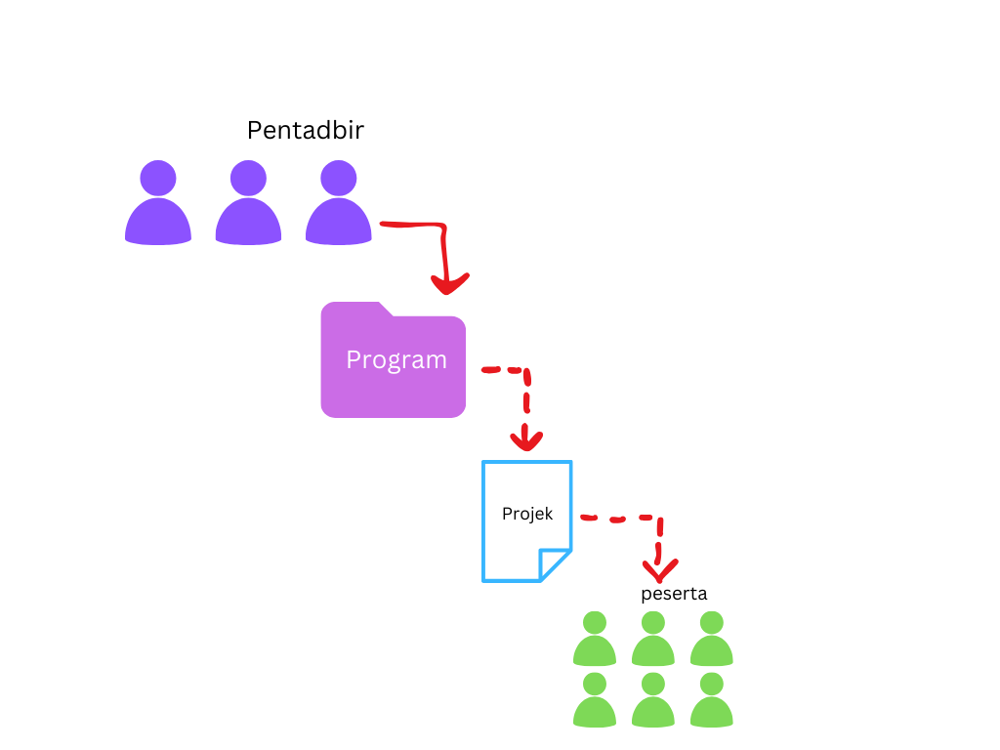

# Asas sistem IMPACT4C

IMPACT4C mempunyai beberapa jenis pengguna iaitu :  
- Peserta  
- Pentadbir  
- Pengurus Tertinggi (Super Admin)  

Setiap jenis pengguna mempunyai fungsi yang berbeza. Penduan mendalam ada di bahagian [Pengguna](pengguna.md).

Untuk mengguna sistem Impact4c, pengguna perlu mencipta Program terlebih dahulu. Program adalah superset untuk projek, di dalam program boleh mencipta atau ditambah beberapa projek. Selepas mencipta program dan projek, pengguna boleh mencipta peserta dan mengisi pencapaian peserta.

<figure markdown>
{ align=center }
 <figcaption>Illustrasi arkitetur sistem IMPACT4C</figcaption>
</figure>